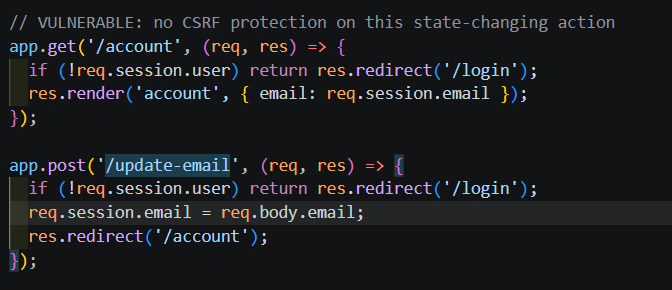
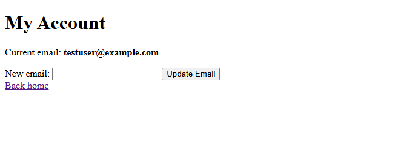
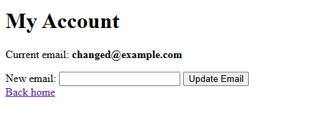
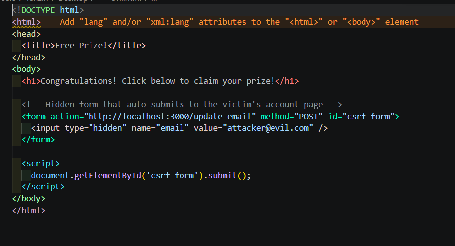
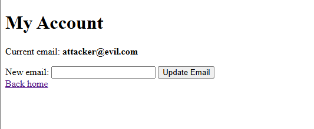
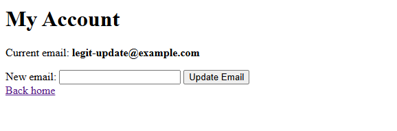
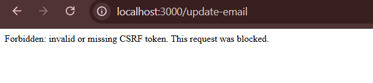
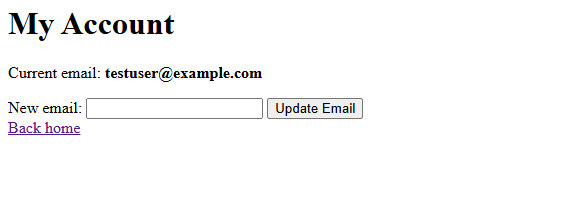

# WEB404 Assignment 1 Report: CSRF (Cross Site Request Forgery)

**Student:** Tenzin Namgay (Cuney)
**Student ID:** 02230307

## Introduction

For this assignment I chose CSRF as my topic. I built a small Node.js and Express app with a login system and an account page where a logged in user can update their email. First I built this feature with no CSRF protection at all, then I attacked it myself to prove the vulnerability was real, then I fixed it using CSRF tokens, and finally I attacked it again to confirm the fix actually worked.

## The Vulnerable Code

The `/account` and `/update-email` routes originally had no CSRF check anywhere. Any POST request to `/update-email` would go through and change the logged in user's email, no matter where the request came from.

## Confirming Normal Use Works

Before attacking anything, I confirmed the feature worked normally for a real logged in user. Here is the account page before any change.

After typing a new email and submitting the form myself, it updated correctly.

## Building the Attack

To simulate an attacker, I created a separate HTML page completely outside my project, meant to represent a malicious website. It contained a hidden form pointing at my app's `/update-email` route, pre filled with the attacker's chosen email, set to submit itself automatically using JavaScript as soon as the page loaded.

## Running the Attack

While still logged in as `testuser` on my app in one browser tab, I opened the malicious page in another tab. The hidden form submitted itself instantly, with no click needed from me. When I checked my account page afterward, my email had changed to `attacker@evil.com`, even though I never typed that or clicked anything on that page myself. This proved the vulnerability was real and exploitable.

## The Fix

To fix this, I added CSRF token protection using the `csrf-csrf` package. A unique token is now generated for each session and included as a hidden field in the account form. When the `/update-email` route receives a request, it checks that the token in the request matches the one tied to the session. If it does not match or is missing, the request is rejected.

I also had to install `cookie-parser`, since `csrf-csrf` needs it to read the token cookie.

## Retesting Normal Use After the Fix

I confirmed the legitimate form still worked correctly after adding the token check, since the form now sends the correct token along with the request.

## Retesting the Attack After the Fix

I then repeated the exact same attack using the same malicious page. This time the request was rejected with a message saying the CSRF token was invalid or missing. The malicious page has no way of knowing the correct token, since it is tied to my session and never exposed to other sites.

Checking my account afterward confirmed the email was untouched by the attack.

Note: the server was restarted between the fix and the retest to add error handling for the CSRF check, which reset the demo account's email back to its default test value. This is why the email shown here is the original `testuser@example.com` and not `legit-update@example.com` from the previous step.

## Conclusion

This assignment showed me how a simple form with no CSRF protection can be exploited by a completely unrelated website, just by tricking a logged in user into visiting it. Adding a CSRF token tied to the session was enough to block the attack completely, while keeping the normal login and update flow working exactly as before.